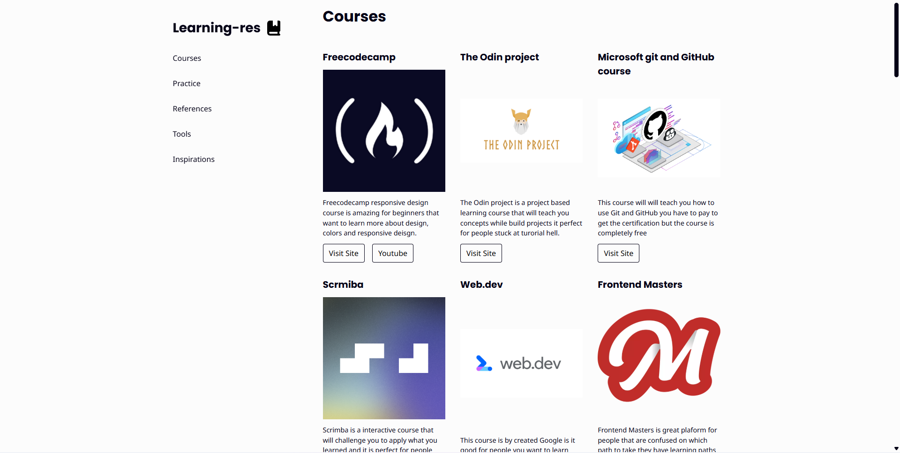
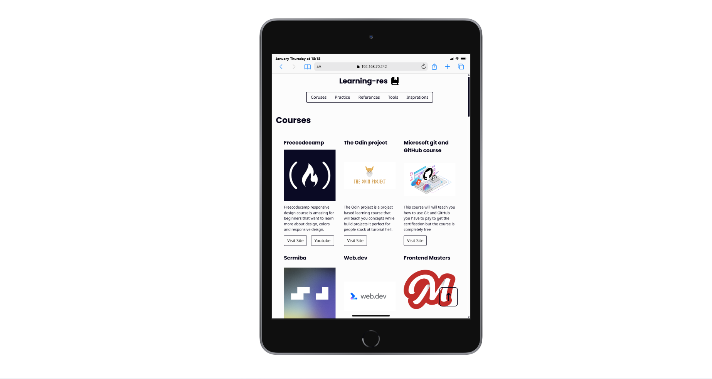
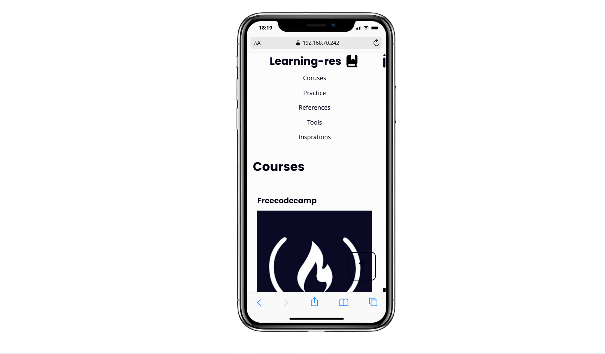

# learn-res (personal project)

I created This project to help people that have a hard time finding high quality resources. 

Everything from learning frontend to backend in one page even the tools that most developers use i will add more resources in the future.

Page link [Click here](https://mohammedaref11.github.io/Learn-res/)

## Desktop

## Tablet

## Mobile 

